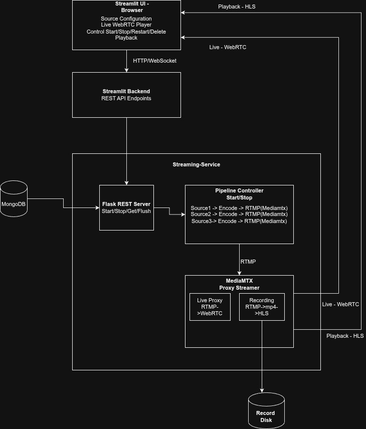

# Live Video Streaming Solution - Design Document

## 1. System Overview

A containerized live video streaming solution built with:
- **Streamlit UI/Backend** - Web interface for stream control and viewing
- **Streaming-Service** 
  - **Python Flask** based REST server
  - **Gstreamer**: Managing video pipelines, transcoding, timestamp, overlay, etc
  - **MediaMTX** - WebRTC/HLS/RTMP protocol server for live delivery and playback, with proxy support
  - **Python Ultralytics**: Object detection using 'yolov8n' model on decoded frames
- **MongoDB** - NoSQL database for streams, recordings, and detections metadata


**Core Flow:**
```
Camera/RTSP → GStreamer (decode→AI→overlay→encode) → MediaMTX (RTMP) → WebRTC/HLS → Browser
                           ↓
                      MongoDB 
```

---

## 2. Architecture Diagram



## 3. Component Details

### 3.1 UI Service (Streamlit)

**Purpose:** User interface and lightweight REST API server

**Tech Stack:**
- Streamlit for UI
- requests for inter-service calls

**Pages:**
1. **Live View (`live.py`):**
   - Radio button: WebCam / IP Camera
   - If WebCam: auto-detect or dropdown
   - If IP Camera: text input for RTSP URL
   - Submit → create stream → redirect to live view

2. **Playback View (`pages/playback.py`):**
   - Fetch recording based on stream_id and timestamp
   - Click recording → playback in HLS player

**API Endpoints (internal Streamlit functions):**
- `create_stream(id, source, source_type)` → POST to streaming-service
- `stop_stream(id)` → POST to streaming-service
- `restart_stream(id)` → POST to streaming-service
- `delete_stream(id)` → POST to streaming-service
- `stop_all_streams()` → POST to streaming-service
- `get_all_streams()` → GET from streaming-service
- `get_recordings(stream_id)` → GET from streaming-service
- `flush_db()` → POST to streaming-service


### 3.2 Streaming-Service

**Purpose:** Manage video pipelines, MediaMTX integration

**Tech Stack:**
- Python Flask for internal REST API
- pymongo for DB writes
- GStreamer
- MediaMTX (sidecar)

**Components:**

1. **Stream Manager (Flask API):**
   - `POST /internal/streams/start`
   - `POST /internal/streams/stop`
   - `POST /internal/streams/restart`
   - `POST /internal/streams/delete`
   - `POST /internal/streams/stop_all`
   - `GET /internal/streams/get_all_streams`
   - `GET /internal/streams/get_recordings`
   - `POST /internal/streams/flush_db`

2. **Pipeline Controller (`pipeline.py`):**
   - Manages per-stream GStreamer pipelines
   - Launches pipeline and monitors state

3. **MediaMTX Integration:**
   - Runs MediaMTX as a separate process
   - Python code pushes RTMP to `rtmp://localhost:1935/{stream_id}`
   - MediaMTX config enables WebRTC, HLS, and recording
   - Converts RTMP to WebRTC and also records to disk
   - Server Playback using HLS
   - Control APIs to fetch recordings and playback URLs

**GStreamer Pipeline:**
```
  source !
  decodebin ! 
  videoconvert ! 
  video/x-raw,format=I420 ! 
  clockoverlay time-format="%Y-%m-%d %H:%M:%S" halignment=right valignment=bottom shaded-background=true !
  x264enc bitrate=2000 speed-preset=ultrafast tune=zerolatency ! 
  flvmux streamable=true ! 
  rtmpsink location={self.rtmp_base}/{webrtc_path}

```

**Gstreamer with AI Processing:**
```
   source !
   decodebin !
   videoconvert ! video/x-raw,format=BGR !
   clockoverlay time-format="%Y-%m-%d %H:%M:%S" halignment=right valignment=bottom shaded-background=true !
   appsink name=ai_sink emit-signals=true max-buffers=1 drop=true sync=false

   Appsink callback -> AI Processing (YOLOv8) -> Overlay boxes -> Encode -> RTMP (using ffmpeg)
```

### 3.3 MongoDB

**Purpose:** Store stream metadata

**Collections:**

1. **streams:**
```json
{
  "_id": ObjectId,
  "stream_id": "uuid-string",
  "source_type": "webcam" | "rtsp",
  "source_spec": { "device": "/dev/video0" } | { "rtsp_url": "rtsp://..." },
  "status": "live" | "stopped" | "error",
  "webrtc_path": "office-cam",
  "created_at": ISODate,
  "updated_at": ISODate
}
```

## 4. Data Flows

### 4.1 Stream Creation and Live View
```
User selects WebCam/RTSP → UI calls streaming-service POST /internal/streams/start
→ streaming-service launches pipeline → pushes to MediaMTX RTMP
→ MediaMTX exposes WebRTC endpoint → UI gets webrtc_path
→ UI redirect to live view with WebRTC player

```

### 4.2 Playback
```
User clicks recording → UI navigates to playback page
→ UI calls streaming-service GET /internal/streams/get_recordings
→ Streaming-service queries MediaMTX for recordings: http://localhost:9996/list?path={webrtc_path}&start={start_time}&end={end_time}
→ Display HLS player with URL: http://localhost:9996/recordings/{path}/index.m3u8
→ Browser plays HLS segments
```

**End of Design Document**
